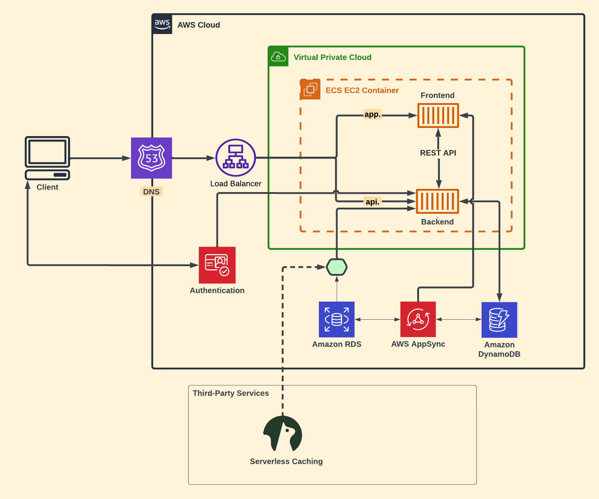

# week 0 — Billing and Architecture


## Getting the AWS CLI Working

I'll be using the AWS CLI often in this project,
so I'll proceed to installing this account.


### Install AWS CLI

- I am going to install the AWS CLI when my Gitpod enviroment lanuches.
- I am going to set AWS CLI to use partial autoprompt mode to make it easier to debug CLI commands.
- The bash commands I am using are the same as the [AWS CLI Install Instructions]https://docs.aws.amazon.com/cli/latest/userguide/getting-started-install.html


Update the `.gitpod.yml` to include the following task.

```sh
tasks:
  - name: aws-cli
    env:
      AWS_CLI_AUTO_PROMPT: on-partial
    init: |
      cd /workspace
      curl "https://awscli.amazonaws.com/awscli-exe-linux-x86_64.zip" -o "awscliv2.zip"
      unzip awscliv2.zip
      sudo ./aws/install
      cd $THEIA_WORKSPACE_ROOT
```

I'll also run these commands indivually to perform the install manually

### Create a new User and Generate AWS Credentials

- Go to (IAM Users Console](https://us-east-1.console.aws.amazon.com/iam/home?region=us-east-1#/users) mehannioui create a new user
- `Enable console access` for the user
- Create a new `Admin` Group and apply `AdministratorAccess`
- Create the user and go find and click into the user
- Click on `Security Credentials` and `Create Access Key`
- Choose AWS CLI Access
- Download the CSV with the credentials

### Set Env Vars

I will set these credentials for the current bash terminal
```
export AWS_ACCESS_KEY_ID=""
export AWS_SECRET_ACCESS_KEY=""
export AWS_DEFAULT_REGION=us-east-1
```

I'll tell Gitpod to remember these credentials if I relaunch our workspaces
```
gp env AWS_ACCESS_KEY_ID=""
gp env AWS_SECRET_ACCESS_KEY=""
gp env AWS_DEFAULT_REGION=us-east-1
```

### Check that the AWS CLI is working and you are the expected user

```sh
aws sts get-caller-identity
```

You should see something like this:
```json
{
    "UserId": "AIDAVPAMTDFDIPQEA6D4V",
    "Account": "375836055878",
    "Arn": "arn:aws:iam::375836055878:user/mehannioui"
}
```

## Enable Billing 

I need to turn on Billing Alerts to recieve alerts...


- In my Root Account under the [Billing Page](https://console.aws.amazon.com/billing/)
- Under `Billing Preferences` Choose `Receive Billing Alerts`
- Save Preferences


## Creating a Billing Alarm

### Create SNS Topic

- I need an SNS topic before I create an alarm.
- The SNS topic is what will deliver us an alert when I get overbilled
- [aws sns create-topic](https://docs.aws.amazon.com/cli/latest/reference/sns/create-topic.html)

I'll create a SNS Topic
```sh
aws sns create-topic --name billing-alarm
```
which will return a TopicARN

I'll create a subscription supply the TopicARN and our Email
```sh
aws sns subscribe \
    --topic-arn "arn:aws:sns:us-east-1:375836055878:billing-alarm" \
    --protocol email \
    --notification-endpoint mehannioui@gmail.com
```

Check your email and confirm the subscription

#### Create Alarm

- [aws cloudwatch put-metric-alarm](https://docs.aws.amazon.com/cli/latest/reference/cloudwatch/put-metric-alarm.html)
- [Create an Alarm via AWS CLI](https://aws.amazon.com/premiumsupport/knowledge-center/cloudwatch-estimatedcharges-alarm/)
- I need to update the configuration json script with the TopicARN I generated earlier
- It is just a json file because --metrics is is required for expressions and so its easier to us a JSON file.

```sh
aws cloudwatch put-metric-alarm --cli-input-json file://aws/json/alarm_config.json
```

## Create an AWS Budget

[aws budgets create-budget](https://docs.aws.amazon.com/cli/latest/reference/budgets/create-budget.html)

Get my AWS Account ID
```sh
aws sts get-caller-identity --query Account --output text
```

- Supply my AWS Account ID
- Update the json files
- This is another case with AWS CLI its just much easier to json files due to lots of nested json

```sh
aws budgets create-budget \
    --account-id $AWS_ACCOUNT_ID \
    --budget file://aws/json/budget.json \
    --notifications-with-subscribers file://aws/json/budget-notifications-with-subscribers.json
```

## FlashFizz Logical Diagram ([Lucid Chart Link](https://lucid.app/lucidchart/9b5e38fa-f73a-4f15-94a0-958480f9b707/edit?invitationId=inv_2decb320-a472-4d83-ae69-b3a86074867c))

